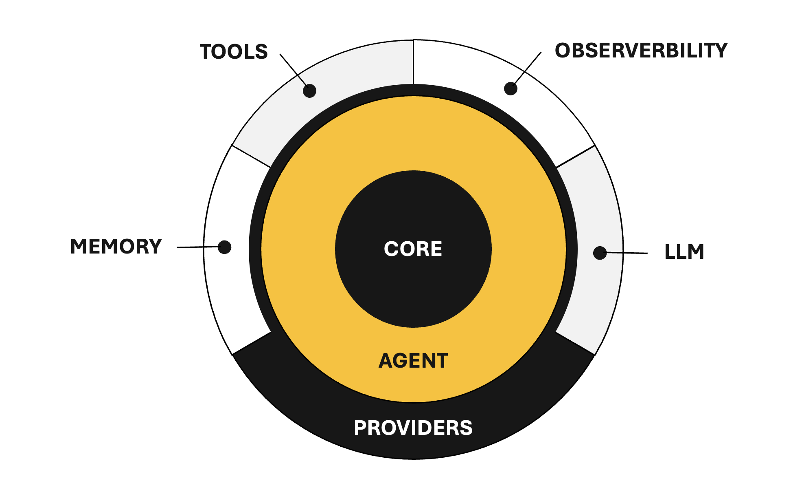

# Agentic Engineering Framework

[](https://www.npmjs.com/package/@agentic-eng/agent)
[](https://opensource.org/licenses/MIT)
[](https://www.typescriptlang.org/)

> **Beta** — API may change before 1.0. Feedback welcome!

---

## What is the Agentic Engineering Framework?

The Agentic Engineering Framework is a minimal, type-safe TypeScript framework for building LLM-powered agent systems. It provides the building blocks for agents that can **reason**, **use tools**, **persist knowledge**, and **emit observable events** — all with a clean, composable API and **zero LLM lock-in**.



### Package Ecosystem

The framework is modular — install only what you need:

| Package | Description |
| --- | --- |
| **`@agentic-eng/agent`** (this package) | `Agent` class, reasoning loop, and re-exports from core packages |
| [`@agentic-eng/core`](https://www.npmjs.com/package/@agentic-eng/core) | Shared types, enums, and error classes |
| [`@agentic-eng/provider`](https://www.npmjs.com/package/@agentic-eng/provider) | Interface-only contracts (`LlmProvider`, `MemoryProvider`, `ObservabilityProvider`) |
| [`@agentic-eng/tool`](https://www.npmjs.com/package/@agentic-eng/tool) | `Tool` interface and `ToolRegistry` |
| [`@agentic-eng/memory`](https://www.npmjs.com/package/@agentic-eng/memory) | Memory implementations (`FlatFileMemory`) |
| [`@agentic-eng/observability`](https://www.npmjs.com/package/@agentic-eng/observability) | Observability implementations (`ConsoleObserver`, `NoopObserver`) |

**This package** (`@agentic-eng/agent`) is the main entry point. It re-exports all types from `core`, all interfaces from `provider`, and the `ToolRegistry` from `tool` — so for most users, this is the only required install. Memory and observability implementations are optional add-ons.


## Installation

```bash
npm install @agentic-eng/agent

# Optional — add concrete implementations as needed:
npm install @agentic-eng/memory          # FlatFileMemory (KNL-based persistence)
npm install @agentic-eng/observability    # ConsoleObserver, NoopObserver
```


## Quick Start

### 1. Implement an LLM Provider

The framework ships zero LLM dependencies — you bring your own backend (OpenAI, Anthropic, local models, etc.):

```typescript
import type { LlmProvider } from '@agentic-eng/provider';
import type { Message, Completion, CompletionChunk } from '@agentic-eng/core';

const myProvider: LlmProvider = {
  async chat(messages: Message[]): Promise<Completion> {
    const response = await callYourLLM(messages);
    return { message: { role: 'assistant', content: response.text } };
  },

  async *chatStream(messages: Message[]): AsyncIterable<CompletionChunk> {
    for await (const chunk of streamYourLLM(messages)) {
      yield { delta: chunk.text, done: chunk.finished };
    }
  },
};
```

### 2. Create an Agent

```typescript
import { Agent } from '@agentic-eng/agent';

const agent = new Agent({
  name: 'assistant',
  provider: myProvider,
  systemPrompt: 'You are a helpful assistant.',
});
```

### 3. Invoke the Agent

**Non-streaming** — runs the full reasoning loop and returns the final result:

```typescript
const result = await agent.invoke('What is the capital of Thailand?');
console.log(result.content);               // "Bangkok is the capital of Thailand."
console.log(result.trace.totalIterations);  // 1
```

**Streaming** — yields chunks as they arrive (single-pass, no reasoning loop):

```typescript
for await (const chunk of agent.invokeStream('Tell me about Thailand.')) {
  process.stdout.write(chunk.delta);
}
```


## Adding Tools for Agent

Tools let the agent interact with external systems. Define tools with the `Tool` interface and group them in a `ToolRegistry` (both re-exported from `@agentic-eng/tool`):

```typescript
import { ToolRegistry } from '@agentic-eng/tool';
import type { Tool } from '@agentic-eng/tool';

const calculator: Tool = {
  definition: {
    name: 'calculator',
    description: 'Evaluates arithmetic expressions.',
    inputSchema: {
      type: 'object',
      properties: {
        expression: { type: 'string', description: 'Math expression to evaluate' },
      },
      required: ['expression'],
    },
  },
  async execute(input) {
    const result = evaluate(input.expression as string);
    return { toolName: 'calculator', success: true, output: String(result) };
  },
};

const tools = new ToolRegistry();
tools.register(calculator);

const agent = new Agent({
  name: 'math-agent',
  provider: myProvider,
  tools,
});

const result = await agent.invoke('What is 42 × 17?');
// Agent calls calculator tool, gets 714, returns formatted answer
```

The agent uses a **hybrid schema approach** to save tokens:
1. **Every LLM call** — only tool names + descriptions are sent (~10 tokens per tool)
2. **When a tool is needed** — the full JSON Schema for that specific tool is injected on demand

This scales well even with 50+ tools registered. See [`@agentic-eng/tool`](https://www.npmjs.com/package/@agentic-eng/tool) for the full `ToolRegistry` API.


## Adding Memory for Agent

Memory lets the agent persist knowledge across invocations. The LLM decides *when* to store information. Install the optional memory package:

```bash
npm install @agentic-eng/memory
```

```typescript
import { FlatFileMemory } from '@agentic-eng/memory';

const agent = new Agent({
  name: 'assistant',
  provider: myProvider,
  memory: new FlatFileMemory({ directory: './agent-memory' }),
});
```

Memories are stored as [KNL](https://github.com/knl-lang/knl) DATA blocks. You can also implement your own backend (vector DB, Redis, Postgres, etc.) — see [`@agentic-eng/memory`](https://www.npmjs.com/package/@agentic-eng/memory) for details, or implement the `MemoryProvider` interface from [`@agentic-eng/provider`](https://www.npmjs.com/package/@agentic-eng/provider) directly.


## Adding Observability for Agent

Every lifecycle point emits a structured event, designed for OTEL integration. Install the optional observability package:

```bash
npm install @agentic-eng/observability
```

```typescript
import { ConsoleObserver } from '@agentic-eng/observability';

const agent = new Agent({
  name: 'assistant',
  provider: myProvider,
  observability: new ConsoleObserver(),
});
```

Console output:

```
[AEF] 14:23:05.123Z INVOKE:START agent="assistant" prompt="What is 42 × 17?"
[AEF] 14:23:05.124Z ITER:START iteration=1/5
[AEF] 14:23:05.125Z LLM:START messages=3
[AEF] 14:23:05.830Z LLM:END tokens=142
[AEF] 14:23:05.831Z TOOL:START tool="calculator"
[AEF] 14:23:05.832Z TOOL:END tool="calculator" success=true
[AEF] 14:23:06.201Z ITER:END iteration=2 action="done"
[AEF] 14:23:06.202Z INVOKE:END agent="assistant" iterations=2 completed=true
```

You can also implement your own observer for OTEL, Datadog, etc. — see [`@agentic-eng/observability`](https://www.npmjs.com/package/@agentic-eng/observability) for details, or implement the `ObservabilityProvider` interface from [`@agentic-eng/provider`](https://www.npmjs.com/package/@agentic-eng/provider) directly.

### Event Types

| Event | When |
| --- | --- |
| `agent.invoke.start` / `end` | Invoke lifecycle |
| `agent.invoke_stream.start` / `end` | Stream lifecycle |
| `agent.iteration.start` / `end` | Each reasoning iteration |
| `llm.call.start` / `end` | Each LLM API call |
| `tool.call.start` / `end` | Tool execution |
| `tool.schema.inject` | Full schema injected for a tool |
| `tool.not_found` | LLM requested unknown tool |
| `memory.store` | Knowledge persisted |
| `agent.error` | Any error during execution |

---


---

## Error Handling

All errors extend `AgenticError` for easy catching:

```typescript
import { MaxIterationsError, ProviderError } from '@agentic-eng/core';

try {
  await agent.invoke('Complex task');
} catch (error) {
  if (error instanceof MaxIterationsError) {
    console.log(`Gave up after ${error.iterationsCompleted} iterations`);
  } else if (error instanceof ProviderError) {
    console.log('LLM call failed:', error.cause);
  }
}
```

| Error | When |
| --- | --- |
| `AgentConfigError` | Invalid agent configuration |
| `ProviderError` | LLM provider call fails |
| `MaxIterationsError` | Reasoning loop exceeds limit |
| `ReasoningParseError` | LLM returns invalid JSON |
| `ToolExecutionError` | Tool execution fails |

---

## API Reference

### `AgentConfig`

```typescript
interface AgentConfig {
  name: string;                       // Required — unique agent name
  provider: LlmProvider;              // Required — your LLM backend
  description?: string;               // What this agent does
  systemPrompt?: string;              // Custom system prompt
  defaultOptions?: ChatOptions;       // Default LLM options (temperature, maxTokens, etc.)
  maxIterations?: number;             // Max reasoning iterations (default: 5)
  memory?: MemoryProvider;            // Knowledge persistence (@agentic-eng/memory)
  tools?: ToolRegistry;               // Available tools (@agentic-eng/tool)
  observability?: ObservabilityProvider; // Event observer (@agentic-eng/observability)
}
```

### `InvokeResult`

```typescript
interface InvokeResult {
  content: string;       // Final answer
  trace: ReasoningTrace; // Full reasoning trace (iterations, completed, totalIterations)
}
```

### `Agent` Methods

| Method | Returns | Description |
| --- | --- | --- |
| `invoke(prompt, options?)` | `Promise<InvokeResult>` | Run reasoning loop to completion |
| `invokeStream(prompt, options?)` | `AsyncIterable<CompletionChunk>` | Stream a single-pass response |
| `getMessages()` | `Message[]` | Copy of conversation history |
| `clearHistory()` | `void` | Reset conversation |

---

## Full Example

```typescript
import { Agent } from '@agentic-eng/agent';
import { ToolRegistry } from '@agentic-eng/tool';
import type { Tool } from '@agentic-eng/tool';
import type { LlmProvider } from '@agentic-eng/provider';
import { FlatFileMemory } from '@agentic-eng/memory';
import { ConsoleObserver } from '@agentic-eng/observability';

// 1. Provider — bring your own LLM
const provider: LlmProvider = { /* your implementation */ };

// 2. Tools — give the agent capabilities
const weatherTool: Tool = {
  definition: {
    name: 'weather',
    description: 'Gets current weather for a city.',
    inputSchema: {
      type: 'object',
      properties: { city: { type: 'string', description: 'City name' } },
      required: ['city'],
    },
  },
  async execute(input) {
    const data = await fetchWeather(input.city as string);
    return { toolName: 'weather', success: true, output: JSON.stringify(data) };
  },
};

const tools = new ToolRegistry();
tools.register(weatherTool);

// 3. Agent — compose everything together
const agent = new Agent({
  name: 'travel-assistant',
  provider,
  systemPrompt: 'You are a helpful travel planning assistant.',
  tools,
  memory: new FlatFileMemory({ directory: './memory' }),
  observability: new ConsoleObserver(),
  maxIterations: 10,
});

// 4. Use
const result = await agent.invoke('What should I pack for Bangkok next week?');
console.log(result.content);
```


## Feedback & Contact

Have questions, feedback, or ideas? I'd love to hear from you:

- **Email:** [lahirunimantha@outlook.com](mailto:lahirunimantha@outlook.com)
- **LinkedIn:** [Lahiru Nimantha](https://www.linkedin.com/in/lahirunimantha/)

## License

[MIT](../../LICENSE)
